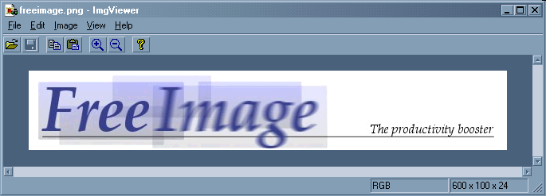

<!--  RadImgViewer -->
 RadImgViewer
==========

This is a utility to quickly view images. It uses [FreeImage](http://freeimage.sourceforge.net/) for loading and saving. I wrote
this mainly because things like ACDSee are too expensive.

Features
--------
- view images quickly
- copy to clipboard
- paste from clipboard
- quickly zoom image view
- quickly pan around image
- convert image format
- rescale image
- colour quantize image
- dither image
- flip image
- rotate image
- invert colours of image
- adjust brightness of image
- adjust contrast of image
- adjust gamma of image
- recolour an image

Controls
--------
- Use the scroll keys to scroll around the image.
- Use Page Up/Down to move faster (use in combination with the Shift key to move horizontally).
- Use the plus/minus key on the keypad to zoom in/out.
- Use the mouse to grab the image to scroll around.
- Use the middle mouse button to lock and scroll the image.
- Use the mouse wheel to scroll vertically (use in combination with the Shift key to move horizontally).
- Use the mouse wheel in combination with the Ctrl key to zoom in/out.
